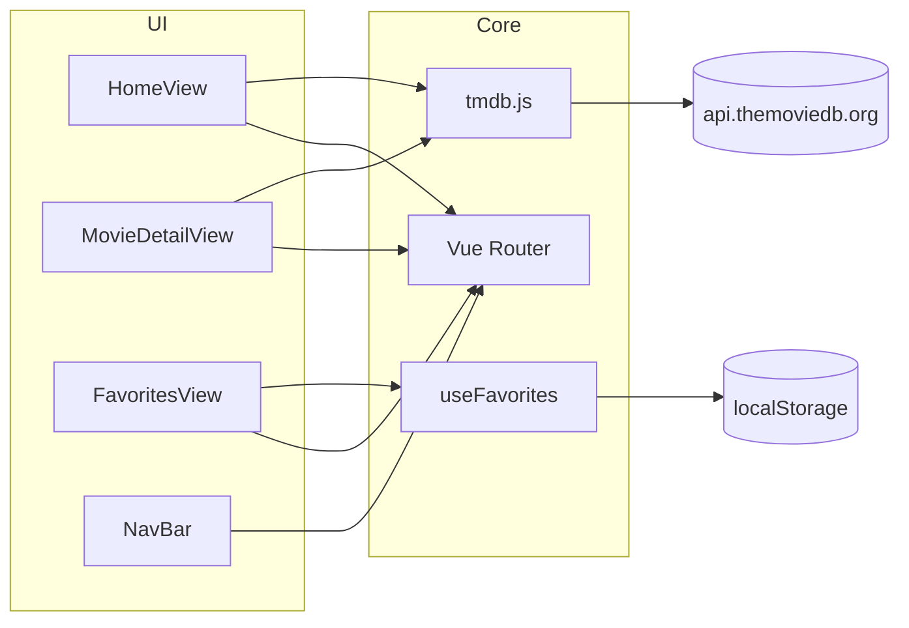

# Parcial Test 2 — Aplicación de Películas (Vue 3 y TMDB)

## Descripción del proyecto

Este repositorio contiene el desarrollo de una **aplicación web de una sola página (SPA)** orientada a la consulta de información cinematográfica. La solución se implementa con **Vue 3**, **Vite** y la API pública de [The Movie Database (TMDB)](https://www.themoviedb.org/?language=es-ES).

El proyecto corresponde al **trabajo práctico** de la asignatura y tiene como finalidad permitir al usuario visualizar películas populares, realizar búsquedas por título, consultar el detalle de cada título, aplicar filtros y, en el caso de los requisitos adicionales, gestionar una lista de favoritos persistida en el cliente, sin dependencia de un servidor propio.

---

## Objetivos y alcance funcional

La consigna académica define los siguientes comportamientos:

| Acción del usuario                  | Requisito de la aplicación                                                                 |
| ----------------------------------- | ------------------------------------------------------------------------------------------ |
| Acceder a la página principal       | Mostrar un listado de **películas populares** obtenidas desde TMDB                         |
| Buscar por título                   | Presentar resultados mediante solicitudes HTTP con **`fetch`**                             |
| Seleccionar una película            | Mostrar **detalle**: título, sinopsis, año de estreno, póster y al menos un dato adicional |
| Aplicar criterios de filtrado       | **Filtrar** por género o por clasificación por edades                                      |
| Requisito adicional: favoritos      | Almacenar selecciones en **`localStorage`**                                                |
| Requisito adicional: interfaz       | Diseño **mobile first**                                                                    |
| Requisito adicional: consumo de API | Utilizar únicamente **`fetch`** nativo (sin axios ni librerías HTTP equivalentes)          |

**Modalidad de entrega:** repositorio publicado en GitHub, con equipos de hasta **tres (3) integrantes**, conforme a lo indicado por la cátedra.

---

## Estado actual del desarrollo

El repositorio se encuentra en una **fase inicial de configuración**. Se dispone de la estructura base del proyecto, pero aún no se han implementado las vistas, componentes, el servicio de integración con TMDB ni la funcionalidad de favoritos.

**Componentes ya configurados:**

- Vue 3, Vite y Vue Router 5
- Alias de importación `@` hacia el directorio `src/`
- Herramientas de calidad de código: ESLint, oxlint y Prettier
- Documentación de arquitectura en `docs/RULES.MD` (referencia interna del equipo)

**Pendiente de implementación:**

- Vistas (`HomeView`, `MovieDetailView`, `FavoritesView`, entre otras)
- Componentes reutilizables (`MovieCard`, `NavBar`, etc.)
- Módulo `src/services/tmdb.js`
- Composable `useFavorites.js`

En la fecha actual, `App.vue` y el arreglo de rutas en `src/router/index.js` constituyen plantillas mínimas. La especificación detallada de patrones, ejemplos de código y relación con la consigna del PDF se documenta en **`docs/RULES.MD`**.

---

## Stack tecnológico

La consigna del trabajo práctico hace referencia al CLI histórico de Vue. Para este proyecto se adoptó el flujo oficial actual mediante **`pnpm create vue`**, que genera un entorno basado en **Vite**. No es necesario migrar el proyecto a `@vue/cli`.

| Tecnología                         | Función en el sistema                                                                            |
| ---------------------------------- | ------------------------------------------------------------------------------------------------ |
| Vue 3                              | Framework principal; Composition API y `<script setup>`                                          |
| Vite 8                             | Servidor de desarrollo, HMR y empaquetado para producción                                        |
| Vue Router 5                       | Enrutamiento; vistas nombradas (_named views_) para separar la barra de navegación del contenido |
| pnpm                               | Gestión de dependencias y ejecución de scripts                                                   |
| API TMDB                           | Fuente de datos: catálogo, búsqueda, discover y detalle                                          |
| Vuetify 4 (planificado)            | Componentes de interfaz y rejilla responsiva                                                     |
| localStorage (requisito adicional) | Persistencia de favoritos en el cliente                                                          |

**Versión de Node.js requerida:** `^20.19.0` o `>=22.12.0` (definido en `package.json`, campo `engines`).

---

## Arquitectura del sistema

### Estructura actual del repositorio

```
Parcial-test-2-Vue/
├── index.html
├── vite.config.js          # Alias @ → src/ y plugin Vue DevTools
├── jsconfig.json
├── package.json
├── docs/
│   └── RULES.MD            # Especificación de arquitectura y convenciones
└── src/
    ├── main.js             # Inicialización de la aplicación y del router
    ├── App.vue             # Componente raíz
    └── router/index.js     # Definición de rutas (pendiente de ampliación)
```

### Estructura objetivo al finalizar el trabajo práctico

```
src/
├── views/
│   ├── HomeView.vue           # Películas populares, búsqueda y filtros
│   ├── MovieDetailView.vue    # Detalle y gestión de favoritos
│   ├── FavoritesView.vue      # Listado persistido en localStorage
│   └── ContactView.vue        # Vista opcional
├── components/
│   ├── NavBar.vue             # Vista nombrada "navbar"
│   ├── MovieCard.vue
│   ├── SearchBar.vue          # Opcional
│   └── MovieFilters.vue       # Opcional
├── services/
│   └── tmdb.js                # Único módulo autorizado para solicitudes HTTP a TMDB
└── composables/
    └── useFavorites.js
```

### Diagrama de componentes



**Principio de diseño:** las vistas no deben realizar solicitudes HTTP directamente hacia TMDB. Toda comunicación con la API externa debe centralizarse en `src/services/tmdb.js`.

---

## Enrutamiento

Se utilizará el patrón de **vistas nombradas** para evitar duplicar la barra de navegación en cada pantalla:

```vue
<!-- App.vue (configuración objetivo) -->
<template>
  <RouterView name="navbar" />
  <RouterView />
</template>
```

| Ruta         | Nombre (`name`) | Componente        | Descripción                         |
| ------------ | --------------- | ----------------- | ----------------------------------- |
| `/`          | `home`          | `HomeView`        | Listado popular, búsqueda y filtros |
| `/movie/:id` | `movie-detail`  | `MovieDetailView` | Ficha de película y favoritos       |
| `/favorites` | `favorites`     | `FavoritesView`   | Colección almacenada localmente     |
| `/contact`   | `contact`       | `ContactView`     | Vista opcional                      |

Las rutas deben definirse con importación dinámica (`() => import('@/views/...')`) a fin de habilitar **carga diferida (lazy loading)** y optimizar el tamaño de los bundles.

---

## Configuración de la API TMDB

1. Registrarse en [themoviedb.org](https://www.themoviedb.org/?language=es-ES).
2. Obtener la **API Key (v3)** en la sección de configuración de la cuenta (Settings → API).
3. Crear un archivo `.env` en la raíz del proyecto (no debe versionarse):

```env
# .env — no incluir en el control de versiones
VITE_TMDB_API_KEY=su_clave_aqui
```

4. Mantener un archivo `.env.example` en el repositorio, sin valores sensibles:

```env
# .env.example — sí debe versionarse
VITE_TMDB_API_KEY=
```

Vite expone al código del cliente únicamente las variables de entorno con prefijo `VITE_`, accesibles mediante `import.meta.env.VITE_TMDB_API_KEY`.

### Recursos y parámetros de la API

| Uso                 | URL o parámetro                                                 |
| ------------------- | --------------------------------------------------------------- |
| API REST            | `https://api.themoviedb.org/3`                                  |
| Imágenes de póster  | `https://image.tmdb.org/t/p/w500` concatenado con `poster_path` |
| Idioma de respuesta | Parámetro de consulta `language=es-ES`                          |

### Correspondencia entre endpoints y funciones del servicio

| Endpoint                | Función prevista en `tmdb.js` |
| ----------------------- | ----------------------------- |
| `GET /movie/popular`    | `fetchPopularMovies`          |
| `GET /search/movie`     | `searchMovies`                |
| `GET /movie/{id}`       | `fetchMovieDetails`           |
| `GET /discover/movie`   | `discoverByGenre`             |
| `GET /genre/movie/list` | `fetchGenres`                 |

Documentación oficial: [developer.themoviedb.org](https://developer.themoviedb.org/docs).

---

## Instalación y ejecución

### Requisitos previos

- Node.js en la versión indicada en `package.json`
- pnpm instalado en el sistema
- Clave de API de TMDB configurada en `.env`

### Procedimiento

```sh
# Clonación e instalación de dependencias
git clone <url-del-repositorio>
cd Parcial-test-2-Vue
pnpm install

# Configuración de variables de entorno
cp .env.example .env
# Editar .env e ingresar el valor de VITE_TMDB_API_KEY

# Servidor de desarrollo (puerto predeterminado: 5173)
pnpm dev
```

### Scripts disponibles

| Comando        | Descripción                                                    |
| -------------- | -------------------------------------------------------------- |
| `pnpm dev`     | Inicia el servidor de desarrollo con recarga en caliente (HMR) |
| `pnpm build`   | Genera el artefacto de producción en el directorio `dist/`     |
| `pnpm preview` | Sirve localmente el build de producción para verificación      |
| `pnpm lint`    | Ejecuta oxlint y ESLint con corrección automática              |
| `pnpm format`  | Aplica Prettier al código fuente en `src/`                     |

---

## Cumplimiento de requisitos (checklist)

Utilizar esta lista para verificar el avance respecto a la consigna del PDF:

- [ ] **(1)** Listado de películas populares en la vista de inicio (`HomeView` + `fetchPopularMovies`)
- [ ] **(2)** Búsqueda por título (`searchMovies` y campo de búsqueda en interfaz)
- [ ] **(3)** Vista de detalle con título, sinopsis, año, póster y al menos un dato adicional (`MovieDetailView`)
- [ ] **(4)** Filtrado por género o clasificación por edades (`discover` / `fetchGenres`)
- [ ] **(5)** Favoritos con persistencia en `localStorage` (`useFavorites` y control en detalle)
- [ ] **(6)** Interfaz mobile first (rejilla responsiva, por ejemplo `cols="12"` con breakpoints `sm`, `md`, `lg`)
- [ ] **(7)** Consumo de API exclusivamente mediante `fetch` (sin axios ni librerías HTTP adicionales)

El orden de implementación recomendado se detalla en la sección correspondiente de `docs/RULES.MD`: servicio TMDB, componente `MovieCard`, búsqueda, filtros, detalle, favoritos y barra de navegación.

---

## Convenciones de desarrollo

1. Textos de la interfaz de usuario en **español**; identificadores de variables, funciones y archivos de lógica en **inglés**.
2. Nomenclatura de componentes en **PascalCase** (por ejemplo, `MovieCard.vue`).
3. Centralización de todas las solicitudes HTTP en `src/services/tmdb.js`.
4. Estado local en vistas mediante `ref` y `computed`; lógica reutilizable en el directorio `composables/`.
5. Tratamiento explícito de estados **`loading`** y **`error`** en operaciones asíncronas.
6. No versionar el archivo `.env`; sí incluir `.env.example` en el repositorio.
7. Ejecutar `pnpm lint` antes de integrar cambios a la rama principal.

---

## Configuración del entorno de desarrollo

### Alias de importación

```js
import { fetchPopularMovies } from '@/services/tmdb'
```

El símbolo `@` resuelve al directorio `src/`, según `vite.config.js` y `jsconfig.json`.

### Herramientas recomendadas

- **Editor:** Visual Studio Code con la extensión [Vue - Official (Volar)](https://marketplace.visualstudio.com/items?itemName=Vue.volar). Se recomienda deshabilitar Vetur si estuviera instalado.
- **Navegador:** [Vue.js devtools](https://chromewebstore.google.com/detail/vuejs-devtools/nhdogjmejiglipccpnnnanhbledajbpd). El proyecto incluye `vite-plugin-vue-devtools` en el entorno de desarrollo.

---

## Problemas frecuentes y soluciones

| Manifestación                    | Causa probable                                                        | Solución                                                                 |
| -------------------------------- | --------------------------------------------------------------------- | ------------------------------------------------------------------------ |
| API key con valor `undefined`    | Archivo `.env` ausente o nombre de variable incorrecto                | Utilizar exactamente `VITE_TMDB_API_KEY`                                 |
| Imagen de póster no visible      | `poster_path` nulo en la respuesta                                    | Renderizar la imagen solo cuando `posterUrl()` retorne una cadena válida |
| Barra de navegación duplicada    | Navbar incluido en cada vista en lugar del patrón de vistas nombradas | Configurar la vista nombrada `navbar` en el router                       |
| Pérdida de favoritos al recargar | Mutación del arreglo sin persistencia                                 | Utilizar únicamente los métodos `add` y `remove` del composable          |

---

## Documentación de referencia

| Recurso                                                         | Contenido                                                         |
| --------------------------------------------------------------- | ----------------------------------------------------------------- |
| `docs/RULES.MD`                                                 | Arquitectura, ejemplos de implementación, composables y diagramas |
| `docs/Trabajo Práctico.pdf`                                     | Consigna oficial del trabajo práctico (si aplica en el equipo)    |
| [Documentación Vue 3](https://vuejs.org/)                       | Framework                                                         |
| [Documentación Vite](https://vite.dev/)                         | Herramienta de compilación                                        |
| [Documentación Vue Router](https://router.vuejs.org/)           | Enrutamiento                                                      |
| [Documentación API TMDB](https://developer.themoviedb.org/docs) | Integración con datos cinematográficos                            |

---

## Integrantes y entrega

| Integrante            | Responsabilidades |
| --------------------- | ----------------- |
| Tomas Fraile          | Frontend && API   |
| Manuel Agustín Garcia | Frontend && API   |
| Gael Garcia           | Frontend && API   |

**Criterios de entrega:** repositorio en GitHub con el presente README actualizado, archivo `.env.example` incluido y ausencia de credenciales o claves de API en el historial de commits.

---
