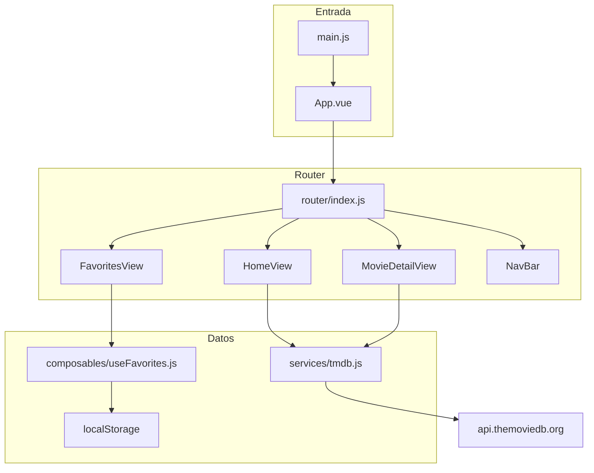
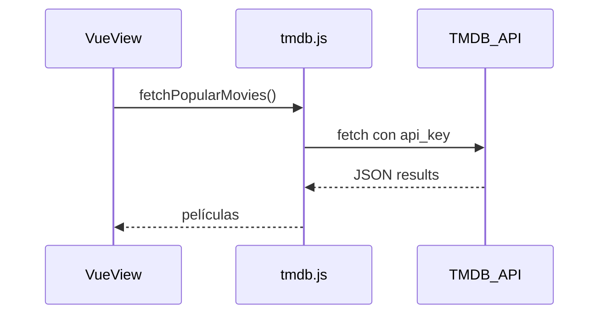

# RULES — Trabajo Práctico: App de Películas (Vue 3 + TMDB)

Guía de arquitectura, convenciones y ejemplos para completar la consigna del [Trabajo Práctico.pdf](./Trabajo%20Pr%C3%A1ctico.pdf) usando **este repositorio** como base.

**Enfoque obligatorio del proyecto:** diseño e implementación **mobile first** — diseñar primero para pantallas pequeñas y ampliar el layout en breakpoints mayores, para que la interfaz sea fácil de usar en celular y tablet (ver §10 y [STYLE-DESIGN.md](./STYLE-DESIGN.md)).

---

## 1. Objetivo de la consigna

Crear una aplicación web con **Vue 3** que permita:

- Ver películas populares en la página de inicio.
- Buscar películas por título.
- Ver el detalle de una película seleccionada (título, descripción, año, póster y al menos un dato más).
- Filtrar resultados (por ejemplo por género o clasificación por edades).
- _(Extra)_ Agregar películas a favoritos con persistencia (`localStorage` o IndexedDB).
- _(Extra en PDF; **obligatorio en este repo**)_ Interfaz **mobile first** — priorizar usabilidad en móvil (touch, una columna, controles grandes).
- _(Extra)_ Obtener datos con **`fetch`** contra [The Movie Database (TMDB)](https://developer.themoviedb.org/docs).

**Entrega:** repositorio en GitHub, grupos de hasta 3 integrantes.

---

## 2. Stack del proyecto (válido para la materia)

Este proyecto se inició correctamente con:

```sh
pnpm create vue@latest
```

La consigna del PDF menciona “Vue.js 3 con el CLI”. En la práctica actual, el equivalente oficial es **create-vue**, que genera **Vite** (no `@vue/cli`). **No hace falta migrar a Vue CLI** ni volver a crear el proyecto.

| Tecnología   | Versión / uso                     | Archivo clave                                |
| ------------ | --------------------------------- | -------------------------------------------- |
| Vue 3        | Composition API, `<script setup>` | Todas las vistas y componentes               |
| Vite         | Dev server y build                | [vite.config.js](./vite.config.js)           |
| Vue Router 5 | Rutas + named views               | [src/router/index.js](./src/router/index.js) |
| Vuetify 4    | UI y grid responsive              | [src/main.js](./src/main.js)                 |
| pnpm         | Gestor de paquetes                | [package.json](./package.json)               |

**Scripts habituales:**

```sh
pnpm install    # dependencias
pnpm dev        # desarrollo con HMR
pnpm build      # build de producción
pnpm lint       # ESLint + oxlint
```

---

## 3. Checklist de requisitos (PDF → implementación)

| #   | Requisito                                                     | Nota       | Dónde implementarlo                                             |
| --- | ------------------------------------------------------------- | ---------- | --------------------------------------------------------------- |
| 1   | Lista de películas populares en inicio                        | Mínimo (4) | [HomeView.vue](./src/views/HomeView.vue) + `GET /movie/popular` |
| 2   | Barra de búsqueda por título + lista de resultados            | Mínimo     | Home (o ruta `/search`) + `GET /search/movie`                   |
| 3   | Detalle al seleccionar (título, sinopsis, año, póster, +dato) | Mínimo     | `MovieDetailView` + `GET /movie/{id}`                           |
| 4   | Filtro (género o clasificación)                               | Mínimo     | `GET /discover/movie` o filtros en discover                     |
| 5   | Botón “Agregar a favoritos” + almacenamiento                  | Extra      | Detalle + `useFavorites` + `localStorage`                       |
| 6   | UI **mobile first** (obligatorio en el repo)                  | Extra PDF  | Grid Vuetify, touch targets, una columna por defecto (§10)      |
| 7   | Datos con `fetch` a TMDB                                      | Extra      | [src/services/tmdb.js](./src/services/tmdb.js) — **sin axios**  |

---

## 4. Arquitectura del proyecto

### 4.1 Estado actual

```
vuetify-init/
├── index.html
├── package.json
├── vite.config.js          # alias @ → src/
├── jsconfig.json             # paths para el IDE
├── src/
│   ├── main.js               # createApp + Vuetify + router
│   ├── App.vue               # dos RouterView (navbar + contenido)
│   ├── router/index.js       # rutas con lazy load
│   ├── views/
│   │   ├── HomeView.vue      # inicio (grid Vuetify de ejemplo)
│   │   └── ContactView.vue   # plantilla extra
│   └── components/
│       ├── NavBar.vue        # navegación
│       └── Titulo.vue        # componente de ejemplo
```

### 4.2 Estructura objetivo (al completar el TP)

```
src/
├── main.js
├── App.vue
├── router/index.js
├── views/
│   ├── HomeView.vue           # populares + búsqueda + filtros
│   ├── MovieDetailView.vue    # detalle + favoritos
│   ├── FavoritesView.vue      # lista de favoritos
│   └── ContactView.vue        # opcional
├── components/
│   ├── NavBar.vue
│   ├── MovieCard.vue          # tarjeta reutilizable
│   ├── SearchBar.vue          # opcional
│   └── MovieFilters.vue       # opcional
├── services/
│   └── tmdb.js                # único módulo con fetch a TMDB
└── composables/
    └── useFavorites.js        # localStorage
```

### 4.3 Diagrama de flujo



### 4.4 Patrones que ya usa el proyecto (replicar)

**Composition API + `<script setup>`** — sin Options API salvo que el equipo acuerde lo contrario.

**Named views** — el navbar no se repite en cada vista:

```vue
<!-- src/App.vue -->
<template>
  <RouterView name="navbar" />
  <RouterView />
</template>
```

```js
// src/router/index.js — patrón actual
{
  path: '/',
  components: {
    default: () => import('@/views/HomeView.vue'),
    navbar: () => import('@/components/NavBar.vue'),
  },
}
```

**Lazy loading** — `() => import('@/views/...')` para dividir el bundle por ruta.

**Alias `@`** — importaciones desde `src/`:

```js
import { fetchPopularMovies } from '@/services/tmdb'
```

Configurado en [vite.config.js](./vite.config.js) y [jsconfig.json](./jsconfig.json).

---

## 5. Flujo funcional por pantalla

### 5.1 Home (`/`)

1. Al montar la vista: `fetchPopularMovies()` → llena `movies`.
2. Mientras carga: `loading === true` → spinner (`v-progress-circular`).
3. Si falla la API: `error` → `v-alert`.
4. Render: `v-row` / `v-col` con `MovieCard` por cada película.
5. Click en una tarjeta → `router.push({ name: 'movie-detail', params: { id } })`.

### 5.2 Búsqueda (misma vista o sección)

1. Usuario escribe en `v-text-field`.
2. Al enviar o tras debounce: `searchMovies(query)`.
3. Reemplazar o alternar `movies` con `data.results`.
4. Si `query` está vacío, volver a populares.

### 5.3 Filtros

1. Al montar (o en Home): `fetchGenres()` → `GET /genre/movie/list`.
2. `v-select` con géneros → `discoverByGenre(genreId)`.
3. Alternativa para clasificación: parámetros de discover según [documentación TMDB](https://developer.themoviedb.org/reference/discover-movie).

### 5.4 Detalle (`/movie/:id`)

1. Leer `const route = useRoute()` → `route.params.id`.
2. `fetchMovieDetails(id)` en `onMounted` o `watch(() => route.params.id)`.
3. Mostrar: `title`, `overview`, año desde `release_date`, `poster_path`, y extras (`vote_average`, `runtime`, `genres`, etc.).
4. Botón favoritos → `addFavorite(movie)` del composable.

### 5.5 Favoritos (`/favorites`)

1. `onMounted`: leer lista desde `localStorage`.
2. Mostrar grid de tarjetas; permitir quitar de favoritos.
3. Click → mismo detalle que en Home.

### 5.6 Secuencia API



---

## 6. TMDB y capa `fetch`

### 6.1 Configuración

1. Crear cuenta en [themoviedb.org](https://www.themoviedb.org/?language=es-ES).
2. En ajustes de API, copiar la **API Key (v3)**.
3. Crear `.env` en la raíz (no commitear):

```env
VITE_TMDB_API_KEY=tu_api_key_aqui
```

4. Crear `.env.example` (sí commitear):

```env
VITE_TMDB_API_KEY=
```

Vite solo expone variables con prefijo `VITE_` a través de `import.meta.env`.

### 6.2 URLs

| Uso                   | URL                                               |
| --------------------- | ------------------------------------------------- |
| API REST              | `https://api.themoviedb.org/3`                    |
| Póster (ejemplo w500) | `https://image.tmdb.org/t/p/w500` + `poster_path` |
| Idioma recomendado    | `language=es-ES` en query params                  |

### 6.3 Servicio central (`src/services/tmdb.js`)

**Regla:** todas las llamadas HTTP van aquí. Las vistas **no** hacen `fetch` directo a TMDB.

```js
// src/services/tmdb.js
const BASE = 'https://api.themoviedb.org/3'
const API_KEY = import.meta.env.VITE_TMDB_API_KEY

const POSTER_BASE = 'https://image.tmdb.org/t/p/w500'

/** Construye URL de imagen de póster */
export function posterUrl(posterPath) {
  if (!posterPath) return null
  return `${POSTER_BASE}${posterPath}`
}

/** Año desde release_date (formato TMDB: YYYY-MM-DD) */
export function releaseYear(releaseDate) {
  if (!releaseDate) return null
  return releaseDate.slice(0, 4)
}

async function tmdbGet(path, params = {}) {
  const url = new URL(`${BASE}${path}`)
  url.searchParams.set('api_key', API_KEY)
  url.searchParams.set('language', 'es-ES')
  Object.entries(params).forEach(([key, value]) => {
    if (value != null && value !== '') {
      url.searchParams.set(key, String(value))
    }
  })

  const res = await fetch(url)
  if (!res.ok) {
    throw new Error(`TMDB ${res.status}: ${path}`)
  }
  return res.json()
}

/** Requisito 1 — películas populares */
export function fetchPopularMovies(page = 1) {
  return tmdbGet('/movie/popular', { page })
}

/** Requisito 2 — búsqueda por título */
export function searchMovies(query, page = 1) {
  return tmdbGet('/search/movie', { query, page })
}

/** Requisito 3 — detalle de película */
export function fetchMovieDetails(id) {
  return tmdbGet(`/movie/${id}`)
}

/** Requisito 4 — filtro por género (discover) */
export function discoverByGenre(genreId, page = 1) {
  return tmdbGet('/discover/movie', { with_genres: genreId, page })
}

/** Lista de géneros para el v-select */
export function fetchGenres() {
  return tmdbGet('/genre/movie/list')
}
```

### 6.4 Uso en una vista (Home)

```vue
<script setup>
import { ref, onMounted } from 'vue'
import { fetchPopularMovies } from '@/services/tmdb'
import MovieCard from '@/components/MovieCard.vue'

const movies = ref([])
const loading = ref(true)
const error = ref(null)

onMounted(async () => {
  try {
    const data = await fetchPopularMovies()
    movies.value = data.results ?? []
  } catch (e) {
    error.value = e instanceof Error ? e.message : 'Error al cargar películas'
  } finally {
    loading.value = false
  }
})
</script>

<template>
  <v-container>
    <v-progress-circular v-if="loading" indeterminate />
    <v-alert v-else-if="error" type="error" :text="error" />
    <v-row v-else>
      <v-col v-for="movie in movies" :key="movie.id" cols="12" sm="6" md="4" lg="3">
        <MovieCard :movie="movie" />
      </v-col>
    </v-row>
  </v-container>
</template>
```

### 6.5 Búsqueda con `fetch`

```vue
<script setup>
import { ref } from 'vue'
import { fetchPopularMovies, searchMovies } from '@/services/tmdb'

const movies = ref([])
const query = ref('')
const loading = ref(false)

async function loadPopular() {
  loading.value = true
  try {
    const data = await fetchPopularMovies()
    movies.value = data.results ?? []
  } finally {
    loading.value = false
  }
}

async function onSearch() {
  const q = query.value.trim()
  if (!q) {
    await loadPopular()
    return
  }
  loading.value = true
  try {
    const data = await searchMovies(q)
    movies.value = data.results ?? []
  } finally {
    loading.value = false
  }
}
</script>

<template>
  <v-text-field
    v-model="query"
    label="Buscar película"
    append-inner-icon="mdi-magnify"
    @keyup.enter="onSearch"
    @click:append-inner="onSearch"
  />
</template>
```

### 6.6 Detalle de película

```vue
<script setup>
import { ref, watch } from 'vue'
import { useRoute } from 'vue-router'
import { fetchMovieDetails, posterUrl, releaseYear } from '@/services/tmdb'
import { useFavorites } from '@/composables/useFavorites'

const route = useRoute()
const movie = ref(null)
const loading = ref(true)
const error = ref(null)
const { add, remove, isFavorite } = useFavorites()

async function loadMovie(id) {
  loading.value = true
  error.value = null
  try {
    movie.value = await fetchMovieDetails(id)
  } catch (e) {
    error.value = e instanceof Error ? e.message : 'Error al cargar'
    movie.value = null
  } finally {
    loading.value = false
  }
}

watch(
  () => route.params.id,
  (id) => {
    if (id) loadMovie(id)
  },
  { immediate: true },
)

function toggleFavorite() {
  if (!movie.value) return
  if (isFavorite(movie.value.id)) {
    remove(movie.value.id)
  } else {
    add(movie.value)
  }
}
</script>

<template>
  <v-container v-if="movie">
    <v-row>
      <v-col cols="12" md="4">
        <v-img
          v-if="posterUrl(movie.poster_path)"
          :src="posterUrl(movie.poster_path)"
          :alt="movie.title"
          cover
        />
      </v-col>
      <v-col cols="12" md="8">
        <h1>{{ movie.title }}</h1>
        <p>Año: {{ releaseYear(movie.release_date) }}</p>
        <p>{{ movie.overview }}</p>
        <p>Valoración: {{ movie.vote_average }}/10</p>
        <p v-if="movie.runtime">Duración: {{ movie.runtime }} min</p>
        <v-btn @click="toggleFavorite">
          {{ isFavorite(movie.id) ? 'Quitar de favoritos' : 'Agregar a favoritos' }}
        </v-btn>
      </v-col>
    </v-row>
  </v-container>
</template>
```

---

## 7. Componentes reutilizables

### 7.1 `MovieCard.vue`

Responsabilidad: mostrar póster, título y enlace al detalle. Sin `fetch` interno.

```vue
<script setup>
import { RouterLink } from 'vue-router'
import { posterUrl, releaseYear } from '@/services/tmdb'

defineProps({
  movie: {
    type: Object,
    required: true,
  },
})
</script>

<template>
  <v-card>
    <RouterLink :to="{ name: 'movie-detail', params: { id: movie.id } }">
      <v-img
        v-if="posterUrl(movie.poster_path)"
        :src="posterUrl(movie.poster_path)"
        :alt="movie.title"
        height="300"
        cover
      />
      <v-card-title>{{ movie.title }}</v-card-title>
      <v-card-subtitle>{{ releaseYear(movie.release_date) }}</v-card-subtitle>
    </RouterLink>
  </v-card>
</template>
```

### 7.2 Filtro por género

```vue
<script setup>
import { ref, onMounted } from 'vue'
import { fetchGenres, discoverByGenre } from '@/services/tmdb'

const genres = ref([])
const selectedGenre = ref(null)
const emit = defineEmits(['update:movies'])

onMounted(async () => {
  const data = await fetchGenres()
  genres.value = data.genres ?? []
})

async function onGenreChange(genreId) {
  if (!genreId) return
  const data = await discoverByGenre(genreId)
  emit('update:movies', data.results ?? [])
}
</script>

<template>
  <v-select
    v-model="selectedGenre"
    :items="genres"
    item-title="name"
    item-value="id"
    label="Género"
    clearable
    @update:model-value="onGenreChange"
  />
</template>
```

---

## 8. Router (rutas objetivo)

Extender [src/router/index.js](./src/router/index.js) manteniendo **named views** en cada ruta:

| Ruta         | `name`         | Vista           | Propósito                    |
| ------------ | -------------- | --------------- | ---------------------------- |
| `/`          | `home`         | HomeView        | Populares, búsqueda, filtros |
| `/movie/:id` | `movie-detail` | MovieDetailView | Detalle + favoritos          |
| `/favorites` | `favorites`    | FavoritesView   | Lista en localStorage        |
| `/contact`   | `contact`      | ContactView     | Opcional (ya existe)         |

```js
// Ejemplo de ruta nueva — añadir al array routes
{
  path: '/movie/:id',
  name: 'movie-detail',
  components: {
    default: () => import('@/views/MovieDetailView.vue'),
    navbar: () => import('@/components/NavBar.vue'),
  },
},
{
  path: '/favorites',
  name: 'favorites',
  components: {
    default: () => import('@/views/FavoritesView.vue'),
    navbar: () => import('@/components/NavBar.vue'),
  },
},
```

Actualizar [NavBar.vue](./src/components/NavBar.vue) con enlaces a Home y Favoritos (idealmente con `v-app-bar` y `RouterLink`).

---

## 9. Favoritos (`localStorage`)

Requisito extra del PDF. **Recomendación:** `localStorage` por simplicidad. IndexedDB es válido si el equipo quiere puntaje extra con más complejidad.

### 9.1 Composable completo

```js
// src/composables/useFavorites.js
import { ref } from 'vue'

const STORAGE_KEY = 'tmdb_favorites'

const favorites = ref([])

function load() {
  try {
    const raw = localStorage.getItem(STORAGE_KEY)
    favorites.value = raw ? JSON.parse(raw) : []
  } catch {
    favorites.value = []
  }
  return favorites.value
}

function save(list) {
  favorites.value = list
  localStorage.setItem(STORAGE_KEY, JSON.stringify(list))
}

function add(movie) {
  const list = load()
  if (list.some((m) => m.id === movie.id)) return
  const minimal = {
    id: movie.id,
    title: movie.title,
    poster_path: movie.poster_path,
    release_date: movie.release_date,
    overview: movie.overview,
  }
  save([...list, minimal])
}

function remove(id) {
  save(load().filter((m) => m.id !== id))
}

function isFavorite(id) {
  return load().some((m) => m.id === id)
}

// Cargar al importar el módulo
load()

export function useFavorites() {
  return {
    favorites,
    load,
    add,
    remove,
    isFavorite,
  }
}
```

### 9.2 Vista de favoritos

```vue
<script setup>
import { computed } from 'vue'
import { useFavorites } from '@/composables/useFavorites'
import MovieCard from '@/components/MovieCard.vue'

const { favorites, load } = useFavorites()
const list = computed(() => load())
</script>

<template>
  <v-container>
    <h1>Mis favoritos</h1>
    <p v-if="list.length === 0">No tenés películas guardadas.</p>
    <v-row v-else>
      <v-col v-for="movie in list" :key="movie.id" cols="12" sm="6" md="4">
        <MovieCard :movie="movie" />
      </v-col>
    </v-row>
  </v-container>
</template>
```

---

## 10. Vuetify y diseño mobile first (obligatorio)

Toda vista y componente debe diseñarse **primero para móvil** y luego escalar a pantallas más anchas. El objetivo es una interfaz **fácil de usar** con el pulgar: lectura clara, controles alcanzables y sin scroll horizontal innecesario.

El proyecto ya usa grid responsive en [HomeView.vue](./src/views/HomeView.vue):

```vue
<v-col cols="12" sm="12" md="6" lg="4">...</v-col>
```

**Principio mobile first:** escribir estilos y props de grid para el viewport más pequeño; solo en `sm` / `md` / `lg` añadir columnas, márgenes o tipografía mayor. No diseñar en desktop y “achicar” después.

**Convenciones obligatorias:**

- Por defecto una columna: `cols="12"`.
- A partir de `sm` / `md` / `lg`, más columnas en pantallas anchas.
- Contenedor: `v-container` con padding automático; evitar anchos fijos que desborden en 320–390px.
- Tarjetas: ancho completo en móvil; imágenes con `cover` y altura fija razonable.
- Navegación: `v-app-bar` fija arriba; botones y enlaces con **área táctil ≥ 48px** (`size="large"` en móvil si hace falta).
- Formularios: `v-text-field` y `v-select` a ancho completo en móvil; acciones principales visibles sin zoom.
- Detalle: apilar póster y texto en una columna (`cols="12"`); pasar a dos columnas desde `md`.
- Probar en DevTools (vista móvil) antes de dar por cerrada una pantalla.

**Componentes Vuetify sugeridos:**

| Necesidad       | Componente            |
| --------------- | --------------------- |
| Búsqueda        | `v-text-field`        |
| Filtro género   | `v-select`            |
| Lista / tarjeta | `v-card`, `v-img`     |
| Carga           | `v-progress-circular` |
| Error           | `v-alert`             |
| Acción          | `v-btn`               |

---

## 11. Reglas del equipo (código)

1. **Mobile first obligatorio:** layout, grid y componentes pensados primero para móvil; usabilidad táctil y legibilidad en pantallas pequeñas (detalle en §10 y STYLE-DESIGN).
2. **UI en español**; nombres de variables, funciones y archivos de lógica en **inglés**.
3. **Componentes:** archivos en PascalCase (`MovieCard.vue`).
4. **Un solo lugar para HTTP:** `src/services/tmdb.js` con `fetch` nativo — no usar axios ni otras librerías HTTP salvo acuerdo explícito.
5. **Estado en vistas:** `ref` / `computed`; lógica compartida en `composables/`.
6. **No poner lógica de API en el template** — solo expresiones simples y bindings.
7. **Secrets:** nunca commitear `.env`; sí `.env.example`.
8. **Manejar siempre** `loading` y `error` en operaciones async.
9. **Respetar** ESLint y Prettier (`pnpm lint`, format on save).
10. **Commits:** mensajes claros; PR en GitHub según indique la cátedra.

---

## 12. Orden de implementación sugerido

1. Crear `.env` y `.env.example`; implementar `src/services/tmdb.js` y probar `fetchPopularMovies` en Home.
2. Crear `MovieCard.vue` y listar populares en Home con grid responsive.
3. Agregar búsqueda por título en Home.
4. Agregar `fetchGenres` + `v-select` y discover por género.
5. Crear ruta `/movie/:id`, `MovieDetailView` y navegación desde la tarjeta.
6. Implementar `useFavorites.js`, botón en detalle y ruta `/favorites`.
7. Mejorar `NavBar` (Home, Favoritos) y pulir mobile first.
8. Actualizar [README.md](./README.md) con pasos para clonar, `pnpm install`, API key y `pnpm dev`.

---

## 13. Referencia rápida TMDB

| Endpoint                       | Método en `tmdb.js`  |
| ------------------------------ | -------------------- |
| `/movie/popular`               | `fetchPopularMovies` |
| `/search/movie?query=`         | `searchMovies`       |
| `/movie/{id}`                  | `fetchMovieDetails`  |
| `/discover/movie?with_genres=` | `discoverByGenre`    |
| `/genre/movie/list`            | `fetchGenres`        |

Documentación: [developer.themoviedb.org](https://developer.themoviedb.org/docs).

---

## 14. Errores frecuentes

| Problema               | Causa                                   | Solución                                                               |
| ---------------------- | --------------------------------------- | ---------------------------------------------------------------------- |
| `undefined` en API key | Falta `.env` o nombre incorrecto        | Variable debe ser `VITE_TMDB_API_KEY`                                  |
| CORS en desarrollo     | Llamar API desde otro dominio sin proxy | TMDB permite browser con api_key en query; si falla, revisar URL y key |
| Imagen rota            | `poster_path` null                      | Usar `v-img` solo si `posterUrl()` devuelve string                     |
| Navbar duplicado       | No usar named views                     | Mantener `components: { default, navbar }`                             |
| Favoritos no persisten | No llamar `save` tras mutar             | Siempre pasar por `add` / `remove` del composable                      |

---

_Este archivo es la fuente de verdad para desarrollar el trabajo práctico en este repo. Ante duda entre el PDF y una decisión de implementación, priorizar cumplir los 4 requisitos mínimos y luego los extras con `fetch` y TMDB._
