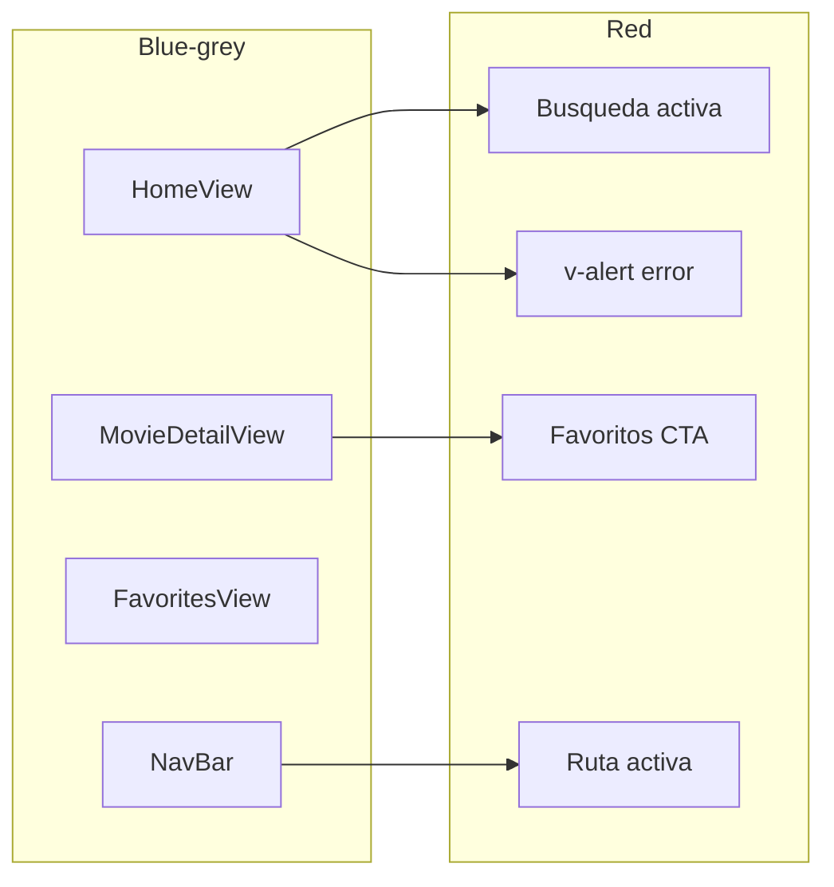

# Style Design — App de Películas (Vue 3 + Vuetify)

Guía visual de referencia para el trabajo práctico descrito en [Trabajo Práctico.pdf](./Trabajo%20Pr%C3%A1ctico.pdf) y la arquitectura de [RULES.MD](./RULES.MD).

**Principio rector:** la paleta **blue-grey** de Material Design define fondos, textos y bordes; la paleta **red** resalta acciones importantes, errores y estados activos. El rojo no debe dominar la interfaz (objetivo: ~15–20 % de superficie acentuada).

---

## 1. Propósito y alcance

Este documento es la **fuente de verdad de diseño** antes y durante la implementación en código. Define tokens, uso por pantalla y convenciones Vuetify para que todo el equipo mantenga coherencia visual.

| Ámbito | Incluye | No incluye (por ahora) |
|--------|---------|-------------------------|
| Diseño | Colores, tipografía, espaciado, componentes Vuetify | Logo, favicon, ilustraciones custom |
| Implementación | Referencia de tema `createVuetify` para `src/main.js` | Instalación de dependencias ni cambios en `src/` |
| Entrega | Alineación con requisitos del PDF y RULES | Commits ni push automáticos |

**Stack asumido (RULES):** Vue 3, Vuetify 4, Vue Router 5, grid responsive mobile first, textos de UI en **español**.

---

## 2. Paletas de color (tokens)

Valores de la [paleta Material Design](https://m2.material.io/design/color/) que Vuetify expone como `blue-grey` y `red`, con variantes `lighten-n`, `darken-n` y `accent-n`.

### 2.1 Blue-grey — estructura neutra

| Token semántico | Clase Vuetify (ejemplo) | Hex | Uso en la app |
|-----------------|-------------------------|-----|---------------|
| `bg-app` | `bg-blue-grey-lighten-5` | `#ECEFF1` | Fondo general (`v-main`, `body`) |
| `bg-surface` | `bg-white` / `bg-blue-grey-lighten-5` | `#FFFFFF` / `#ECEFF1` | `v-card`, sheets, paneles |
| `bg-elevated` | `bg-blue-grey-lighten-4` | `#CFD8DC` | Navbar, barras de filtros, áreas sticky |
| `border-default` | `border-blue-grey-lighten-2` | `#90A4AE` | Bordes de cards, inputs, divisores |
| `border-subtle` | `border-blue-grey-lighten-3` | `#B0BEC5` | Separadores internos, hover en cards |
| `text-primary` | `text-blue-grey-darken-4` | `#263238` | Títulos, nombres de película |
| `text-secondary` | `text-blue-grey-darken-2` | `#455A64` | Sinopsis, subtítulos, metadata (año, género) |
| `text-disabled` | `text-blue-grey-lighten-1` | `#78909C` | Placeholders, estados vacíos, hints |
| `ui-secondary` | `color="blue-grey"` (base) | `#607D8B` | Botones secundarios, iconos inactivos |

### 2.2 Red — acento y énfasis

| Token semántico | Clase Vuetify (ejemplo) | Hex | Uso en la app |
|-----------------|-------------------------|-----|---------------|
| `accent-primary` | `color="red"` | `#F44336` | CTA principal: «Agregar a favoritos», enviar búsqueda |
| `accent-hover` | `red darken-1` | `#E53935` | Hover en botones primarios |
| `accent-subtle` | `bg-red-lighten-5` | `#FFEBEE` | Badge «En favoritos», chips destacados |
| `accent-icon` | `text-red-accent-2` | `#FF5252` | Icono corazón, lupa activa, ítem de nav activo |
| `state-error` | `type="error"` / `red darken-2` | `#D32F2F` | `v-alert` ante fallos de TMDB o validación |

### 2.3 Reglas de uso

1. **Fondos y lectura:** priorizar `bg-app` + cards blancas; texto principal siempre `text-primary` sobre superficies claras.
2. **Rojo:** reservar para una acción principal por vista, navegación activa, favoritos y errores.
3. **Imágenes TMDB:** los pósters aportan color; no competir con rojos saturados en el mismo bloque visual.
4. **Modo oscuro:** fuera de alcance inicial; el tema documentado es **light** (`dark: false`).

---

## 3. Referencia técnica Vuetify (Context7)

Documentación consultada vía [Context7](https://context7.com) (`/vuetifyjs/vuetify`):

- **Clases de color:** cada tono Material genera utilidades `bg-{color}`, `text-{color}`, `border-{color}` y variantes `text-red-darken-1`, etc. ([Colors — Classes](https://github.com/vuetifyjs/vuetify/blob/master/packages/docs/src/pages/en/styles/colors.md)).
- **Tema global:** `createVuetify({ theme: { themes: { ... } } })` define `colors` y `variables`; Vuetify expone variables CSS `--v-theme-*` para estilos custom ([Theme](https://github.com/vuetifyjs/vuetify/blob/master/packages/docs/src/pages/en/features/theme.md)).
- **Props en componentes:** `color="red"`, `bg-color="blue-grey darken-3"` son válidos en `v-btn`, `v-app-bar`, `v-progress-circular`, etc.

Al instalar Vuetify 4, aplicar el tema `moviesTheme` en `src/main.js` (ver sección 4).

---

## 4. Tema Vuetify — implementación futura

Copiar o adaptar cuando el proyecto incluya Vuetify según [RULES.MD](./RULES.MD):

```js
// src/main.js — referencia; no aplicado hasta instalar vuetify
import { createVuetify } from 'vuetify'

const moviesTheme = {
  dark: false,
  colors: {
    background: '#ECEFF1', // blue-grey lighten-5 — bg-app
    surface: '#FFFFFF',
    'surface-bright': '#FFFFFF',
    'surface-light': '#ECEFF1',
    'surface-variant': '#CFD8DC', // blue-grey lighten-4
    'on-surface-variant': '#455A64', // text-secondary
    primary: '#F44336', // red — CTAs
    'primary-darken-1': '#E53935',
    secondary: '#607D8B', // blue-grey base
    'secondary-darken-1': '#546E7A',
    error: '#D32F2F',
    info: '#607D8B',
    success: '#607D8B',
    warning: '#FF5252',
  },
  variables: {
    'border-color': '#90A4AE',
    'border-opacity': 0.24,
    'high-emphasis-opacity': 0.87,
    'medium-emphasis-opacity': 0.6,
    'disabled-opacity': 0.38,
  },
}

export default createVuetify({
  theme: {
    defaultTheme: 'moviesTheme',
    themes: {
      moviesTheme,
    },
  },
})
```

**Clases utilitarias frecuentes (sin tema custom):**

```html
<div class="bg-blue-grey-lighten-5">
  <h1 class="text-blue-grey-darken-4">Título</h1>
  <p class="text-blue-grey-darken-2">Sinopsis</p>
  <v-btn color="red">Agregar a favoritos</v-btn>
</div>
```

**CSS custom con variables de tema:**

```css
.movie-card:hover {
  border-color: rgb(var(--v-theme-secondary));
  background: rgb(var(--v-theme-surface));
}
```

---

## 5. Tipografía y espaciado

| Nivel | Clase / elemento | Uso |
|-------|------------------|-----|
| Título página | `text-h4` / `<h1>` | Detalle de película, «Mis favoritos» |
| Título sección | `text-h5` | «Populares», «Resultados de búsqueda» |
| Título card | `v-card-title` | Nombre de película en grid |
| Cuerpo | `text-body-1` / `text-body-2` | Sinopsis en detalle |
| Metadata | `text-caption` | Año, valoración, duración |

- **Familia:** Roboto (default Vuetify) o stack del sistema.
- **Contenedor:** `v-container` con padding fluido; **16px** en móvil, **24px** desde `md`.
- **Grid mobile first (RULES §10):** `cols="12"` → `sm="6"` → `md="4"` → `lg="3"` en listados de películas.

---

## 6. Requisitos del PDF → decisiones de color

Vinculación entre consigna, pantalla y paleta.

| # | Requisito (PDF) | Vista / componente | Blue-grey | Red |
|---|-----------------|-------------------|-----------|-----|
| 1 | Lista de populares en inicio | `HomeView`, `MovieCard` | Fondo app, cards blancas, títulos darken-4 | — |
| 2 | Búsqueda por título + resultados | `v-text-field`, grid resultados | Campo outlined, bordes lighten-2 | Icono lupa / foco `color="red"` |
| 3 | Detalle (título, sinopsis, año, póster, +dato) | `MovieDetailView` | Textos secundarios, layout | Botón favoritos (extra 5) |
| 4 | Filtro (género o clasificación) | `v-select` / `MovieFilters` | Panel y labels en blue-grey | Opción seleccionada: acento sutil opcional |
| 5 | Favoritos + almacenamiento | Detalle + `FavoritesView` | Lista y vacío en text-secondary | CTA y badge favorito |
| 6 | UI mobile first | Grid, `v-app-bar`, botones ≥ 48px | Estructura responsive neutra | Solo acentos táctiles críticos |
| 7 | Datos con `fetch` TMDB | Estados loading / error | `v-progress-circular color="blue-grey"` | `v-alert type="error"` |

Flujo visual resumido:



---

## 7. Diseño por pantalla (RULES §5–10)

### 7.1 Home (`/`)

**Funcional (RULES §5.1–5.3):** populares al montar, búsqueda, filtros por género.

| Elemento | Estilo |
|----------|--------|
| Fondo | `bg-blue-grey-lighten-5` en `v-main` |
| `MovieCard` | `v-card` blanco, `elevation="2"`, `rounded="lg"`, borde `blue-grey-lighten-2`; hover: `elevation="4"` |
| Búsqueda | `v-text-field` `variant="outlined"`, `color="red"`, label «Buscar película» |
| Filtro género | `v-select` outlined, mismo esquema de borde |
| Carga | `v-progress-circular` `color="blue-grey"` centrado |
| Error API | `v-alert` `type="error"` |

### 7.2 Detalle (`/movie/:id`)

**Funcional (RULES §5.4):** póster, título, overview, año, datos extra, favoritos.

| Elemento | Estilo |
|----------|--------|
| Layout | `v-container`; columna póster `cols="12" md="4"` |
| Título | `text-h4` `text-blue-grey-darken-4` |
| Metadata | `text-caption` `text-blue-grey-darken-2` |
| Sinopsis | `text-body-2` |
| Póster sin imagen | Placeholder `bg-blue-grey-lighten-4` |
| Favoritos | `v-btn color="red" variant="flat"`; estado activo: `bg-red-lighten-5` + icono `mdi-heart` |

### 7.3 Favoritos (`/favorites`)

**Funcional (RULES §5.5, §9):** grid desde `localStorage`.

| Elemento | Estilo |
|----------|--------|
| Título | `text-h4` blue-grey darken-4 |
| Vacío | `text-blue-grey-darken-2` — «No tenés películas guardadas.» |
| Lista | Mismo `MovieCard` que Home |
| Acento | Icono `mdi-heart` `text-red-accent-2` junto al título (opcional) |

### 7.4 NavBar (named view)

**Funcional (RULES §4.4, §8):** `v-app-bar` fija, enlaces Home / Favoritos.

| Elemento | Estilo |
|----------|--------|
| Barra | `color="blue-grey-darken-3"` (`#37474F`), texto `blue-grey-lighten-5` |
| Enlaces | `RouterLink`; inactivo: blanco/lighten-5 |
| Ruta activa | `text-red-accent-2` o subrayado rojo |
| Móvil | Altura mínima 56px; targets táctiles amplios |

### 7.5 Estados globales (RULES §11)

Siempre mostrar **loading** y **error** en operaciones async:

- **Loading:** spinner `blue-grey`, no rojo (evitar ansiedad visual).
- **Error:** `v-alert` rojo del tema; mensaje en español.
- **Éxito / info:** preferir `blue-grey` o texto secundario; no introducir verde/azul fuera de paleta.

---

## 8. Componentes Vuetify — guía rápida

| Necesidad (RULES §10) | Componente | Estilo propuesto |
|----------------------|------------|------------------|
| Búsqueda | `v-text-field` | `variant="outlined"`, `color="red"`, `prepend-inner-icon="mdi-magnify"` |
| Filtro género | `v-select` | Outlined; menú con `bg-white` |
| Lista / tarjeta | `v-card`, `v-img` | Ver §7.1; imagen `cover`, altura ~300px en card |
| Carga | `v-progress-circular` | `color="blue-grey"`, `indeterminate` |
| Error | `v-alert` | `type="error"`, `variant="tonal"` opcional |
| Acción primaria | `v-btn` | `color="red"`, `variant="flat"` |
| Acción secundaria | `v-btn` | `color="blue-grey"`, `variant="outlined"` |

---

## 9. Accesibilidad y UX

- **Contraste:** `text-blue-grey-darken-4` sobre `#ECEFF1` / `#FFFFFF` cumple WCAG AA para cuerpo.
- **Táctil (mobile first):** botones de detalle y navbar con altura mínima **48px** donde sea posible (`size="large"` en móvil).
- **Foco:** respetar anillo de foco de Vuetify; campos con `color="red"` en estado focused.
- **Idioma:** etiquetas y mensajes en español; nombres de código en inglés (RULES §11).

---

## 10. Checklist de coherencia con la entrega

- [ ] UI en español en todos los labels y alertas
- [ ] Jerarquía: explorar (blue-grey) → acción importante (red)
- [ ] Sin colores fuera de blue-grey/red salvo pósters TMDB
- [ ] Grid mobile first según RULES §10
- [ ] `loading` y `error` visibles en cada vista con datos async
- [ ] Al instalar Vuetify: registrar `moviesTheme` en `src/main.js`
- [ ] NavBar con named views sin duplicar estilos por vista

---

## 11. Referencias

- [Trabajo Práctico.pdf](./Trabajo%20Pr%C3%A1ctico.pdf) — requisitos 1–7
- [RULES.MD](./RULES.MD) — arquitectura, flujos §5, Vuetify §10, implementación §12
- [Vuetify — Colors](https://vuetifyjs.com/en/styles/colors/)
- [Vuetify — Theme](https://vuetifyjs.com/en/features/theme/)
- Documentación Vuetify vía Context7 (`/vuetifyjs/vuetify`)

---

_Este archivo complementa RULES.MD: ante duda de color o componente visual, priorizar esta guía y los requisitos mínimos del PDF._
