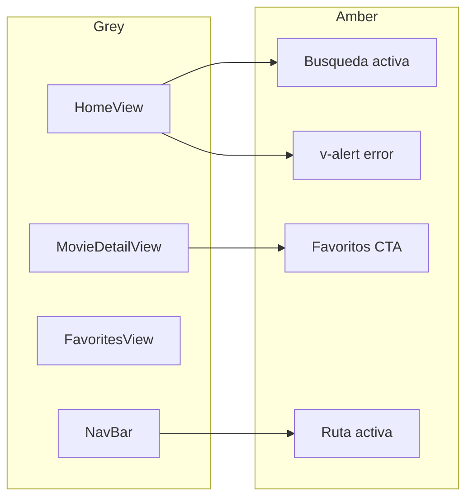

# Style Design — App de Películas (Vue 3 + Vuetify)

Guía visual de referencia para el trabajo práctico descrito en [Trabajo Práctico.pdf](./Trabajo%20Pr%C3%A1ctico.pdf) y la arquitectura de [RULES.MD](./RULES.MD).

**Principios rectores:**

1. **Mobile first (obligatorio):** diseñar e implementar primero para pantallas pequeñas; la interfaz debe ser **fácil de usar** en celular (una columna, controles táctiles grandes, sin desbordes horizontales). Escalar layout y tipografía solo desde breakpoints `sm` / `md` / `lg`.
2. **Paleta:** la **grey** de Material Design define fondos, textos y bordes; la **amber** resalta acciones importantes, errores y estados activos. El ámbar no debe dominar la interfaz (objetivo: ~15–20 % de superficie acentuada).

---

## 1. Propósito y alcance

Este documento es la **fuente de verdad de diseño** antes y durante la implementación en código. Define tokens, uso por pantalla y convenciones Vuetify para que todo el equipo mantenga coherencia visual y **usabilidad en móvil**.

| Ámbito | Incluye | No incluye (por ahora) |
|--------|---------|-------------------------|
| Diseño | Colores, tipografía, espaciado, **mobile first**, componentes Vuetify | Logo, favicon, ilustraciones custom |
| Implementación | Referencia de tema `createVuetify` para `src/main.js` | Instalación de dependencias ni cambios en `src/` |
| Entrega | Alineación con requisitos del PDF y RULES | Commits ni push automáticos |

**Stack asumido (RULES):** Vue 3, Vuetify 4, Vue Router 5, grid responsive **mobile first obligatorio**, textos de UI en **español**.

---

## 2. Paletas de color (tokens)

Valores de la [paleta Material Design](https://m2.material.io/design/color/) que Vuetify expone como `grey` y `amber`, con variantes `lighten-n`, `darken-n` y `accent-n`.

### 2.1 Grey — estructura neutra

| Token semántico | Clase Vuetify (ejemplo) | Hex | Uso en la app |
|-----------------|-------------------------|-----|---------------|
| `bg-app` | `bg-grey-darken-4` | `#212121` | Fondo general (`v-main`, `body`) — tema oscuro |
| `bg-surface` | `bg-grey-darken-3` | `#424242` | `v-card`, sheets, paneles, navbar |
| `bg-elevated` | `bg-grey-darken-2` | `#616161` | Barras de filtros, áreas sticky |
| `border-default` | `border-grey-darken-1` | `#757575` | Bordes de cards, inputs, divisores |
| `border-subtle` | `border-grey` | `#9E9E9E` | Separadores internos, hover en cards |
| `text-primary` | `text-grey-lighten-5` | `#FAFAFA` | Títulos, nombres de película |
| `text-secondary` | `text-grey-lighten-1` | `#BDBDBD` | Sinopsis, subtítulos, metadata (año, género) |
| `text-disabled` | `text-grey` | `#9E9E9E` | Placeholders, estados vacíos, hints |
| `ui-secondary` | `color="grey"` (base) | `#9E9E9E` | Botones secundarios, iconos inactivos |

**Escala completa grey (referencia):**

| Variante | Hex |
|----------|-----|
| grey-lighten-5 | `#FAFAFA` |
| grey-lighten-4 | `#F5F5F5` |
| grey-lighten-3 | `#EEEEEE` |
| grey-lighten-2 | `#E0E0E0` |
| grey-lighten-1 | `#BDBDBD` |
| grey (base) | `#9E9E9E` |
| grey-darken-1 | `#757575` |
| grey-darken-2 | `#616161` |
| grey-darken-3 | `#424242` |
| grey-darken-4 | `#212121` |

### 2.2 Amber — acento y énfasis

| Token semántico | Clase Vuetify (ejemplo) | Hex | Uso en la app |
|-----------------|-------------------------|-----|---------------|
| `accent-primary` | `color="amber"` | `#FFC107` | CTA principal: «Agregar a favoritos», enviar búsqueda |
| `accent-hover` | `amber darken-1` | `#FFB300` | Hover en botones primarios |
| `accent-subtle` | `bg-amber-lighten-5` | `#FFF8E1` | Badge «En favoritos», chips destacados |
| `accent-icon` | `text-amber-accent-2` | `#FFD740` | Lupa activa, ítem de nav activo |
| `state-error` | `type="error"` / `amber darken-3` | `#FF8F00` | `v-alert` ante fallos de TMDB o validación |

**Escala completa amber (referencia):**

| Variante | Hex |
|----------|-----|
| amber-lighten-5 | `#FFF8E1` |
| amber-lighten-4 | `#FFECB3` |
| amber-lighten-3 | `#FFE082` |
| amber-lighten-2 | `#FFD54F` |
| amber-lighten-1 | `#FFCA28` |
| amber (base) | `#FFC107` |
| amber-darken-1 | `#FFB300` |
| amber-darken-2 | `#FFA000` |
| amber-darken-3 | `#FF8F00` |
| amber-darken-4 | `#FF6F00` |
| amber-accent-1 | `#FFE57F` |
| amber-accent-2 | `#FFD740` |
| amber-accent-3 | `#FFC400` |
| amber-accent-4 | `#FFAB00` |

### 2.3 Reglas de uso

1. **Fondos y lectura:** priorizar `bg-app` (`grey-darken-4`) + cards `grey-darken-3`; texto principal `grey-lighten-5` sobre superficies oscuras.
2. **Ámbar:** reservar para una acción principal por vista, navegación activa, favoritos y alertas.
3. **Imágenes TMDB:** los pósters aportan color; no competir con ámbar saturado en el mismo bloque visual.
4. **Tema activo:** **dark** (`moviesDark` en `src/main.js`).

---

## 3. Referencia técnica Vuetify (Context7)

Documentación consultada vía [Context7](https://context7.com) (`/vuetifyjs/vuetify`):

- **Clases de color:** cada tono Material genera utilidades `bg-{color}`, `text-{color}`, `border-{color}` y variantes `text-red-darken-1`, etc. ([Colors — Classes](https://github.com/vuetifyjs/vuetify/blob/master/packages/docs/src/pages/en/styles/colors.md)).
- **Tema global:** `createVuetify({ theme: { themes: { ... } } })` define `colors` y `variables`; Vuetify expone variables CSS `--v-theme-*` para estilos custom ([Theme](https://github.com/vuetifyjs/vuetify/blob/master/packages/docs/src/pages/en/features/theme.md)).
- **Props en componentes:** `color="amber"`, `bg-color="grey darken-3"` son válidos en `v-btn`, `v-app-bar`, `v-progress-circular`, etc.

El tema `moviesDark` está aplicado en `src/main.js` (ver sección 4).

---

## 4. Tema Vuetify — implementación (`src/main.js`)

Tema oscuro **grey + amber** activo en el proyecto:

```js
// src/main.js
import { createVuetify } from 'vuetify'

const moviesDarkTheme = {
  dark: true,
  colors: {
    background: '#212121', // grey darken-4 — bg-app
    surface: '#424242', // grey darken-3 — cards
    'surface-bright': '#616161', // grey darken-2
    'surface-light': '#424242',
    'surface-variant': '#616161',
    'on-surface': '#FAFAFA', // grey lighten-5 — text-primary
    'on-surface-variant': '#BDBDBD', // grey lighten-1 — text-secondary
    'on-background': '#FAFAFA',
    primary: '#FFC107', // amber — CTAs
    'primary-darken-1': '#FFB300',
    secondary: '#9E9E9E', // grey base
    'secondary-darken-1': '#757575',
    error: '#FF8F00', // amber darken-3
    info: '#9E9E9E',
    success: '#9E9E9E',
    warning: '#FFD740', // amber accent-2
  },
  variables: {
    'border-color': '#757575',
    'border-opacity': 0.24,
    'high-emphasis-opacity': 0.87,
    'medium-emphasis-opacity': 0.6,
    'disabled-opacity': 0.38,
  },
}

export default createVuetify({
  theme: {
    defaultTheme: 'moviesDark',
    themes: {
      moviesDark: moviesDarkTheme,
    },
  },
})
```

**Clases utilitarias frecuentes:**

```html
<div class="bg-grey-darken-4">
  <h1 class="text-grey-lighten-5">Título</h1>
  <p class="text-grey-lighten-1">Sinopsis</p>
  <v-btn color="amber">Agregar a favoritos</v-btn>
</div>
```

**CSS custom con variables de tema:**

```css
.movie-card:hover {
  border-color: rgb(var(--v-theme-secondary));
  background: rgb(var(--v-theme-surface));
}
```

---

## 5. Tipografía y espaciado

| Nivel | Clase / elemento | Uso |
|-------|------------------|-----|
| Título página | `text-h4` / `<h1>` | Detalle de película, «Mis favoritos» |
| Título sección | `text-h5` | «Populares», «Resultados de búsqueda» |
| Título card | `v-card-title` | Nombre de película en grid |
| Cuerpo | `text-body-1` / `text-body-2` | Sinopsis en detalle |
| Metadata | `text-caption` | Año, valoración, duración |

- **Familia:** Roboto (default Vuetify) o stack del sistema.
- **Contenedor:** `v-container` con padding fluido; **16px** en móvil, **24px** desde `md`.
- **Grid mobile first (RULES §10):** `cols="12"` → `sm="6"` → `md="4"` → `lg="3"` en listados de películas.

### 5.1 Mobile first — usabilidad (obligatorio)

| Criterio | Regla |
|----------|--------|
| Punto de partida | Maquetar y revisar en viewport ~375px antes que en desktop |
| Columnas | Una columna por defecto; más columnas solo en `sm`+ |
| Touch | Botones, enlaces del nav y CTA con altura mínima **48px** en móvil |
| Formularios | Búsqueda y filtros a ancho completo; no campos estrechos que obliguen zoom |
| Lectura | Sinopsis y metadata con `text-body-2` / `text-caption`; líneas no demasiado largas en móvil |
| Imágenes | Pósters `cover` con altura acotada; no forzar scroll horizontal |
| Detalle | Póster arriba, texto abajo en móvil; layout en dos columnas desde `md` |
| Validación | Probar Home, detalle y favoritos en DevTools (móvil) antes de cerrar la vista |

---

## 6. Requisitos del PDF → decisiones de color

Vinculación entre consigna, pantalla y paleta.

| # | Requisito (PDF) | Vista / componente | Grey | Amber |
|---|-----------------|-------------------|------|-------|
| 1 | Lista de populares en inicio | `HomeView`, `MovieCard` | Fondo app, cards surface, títulos lighten-5 | — |
| 2 | Búsqueda por título + resultados | `v-text-field`, grid resultados | Campo outlined, bordes grey | Icono lupa / foco `color="amber"` |
| 3 | Detalle (título, sinopsis, año, póster, +dato) | `MovieDetailView` | Textos secundarios, layout | Botón favoritos (extra 5) |
| 4 | Filtro (género o clasificación) | `v-select` / `MovieFilters` | Panel y labels en grey | Opción seleccionada: acento sutil opcional |
| 5 | Favoritos + almacenamiento | Detalle + `FavoritesView` | Lista y vacío en text-secondary | CTA y badge favorito |
| 6 | UI **mobile first** (obligatorio en el repo) | Grid, `v-app-bar`, botones ≥ 48px, §5.1 | Estructura responsive neutra | Solo acentos táctiles críticos |
| 7 | Datos con `fetch` TMDB | Estados loading / error | `v-progress-circular color="grey"` | `v-alert type="error"` |

Flujo visual resumido:



---

## 7. Diseño por pantalla (RULES §5–10)

### 7.1 Home (`/`)

**Funcional (RULES §5.1–5.3):** populares al montar, búsqueda, filtros por género.

| Elemento | Estilo |
|----------|--------|
| Fondo | Tema `moviesDark` — `grey-darken-4` en `v-main` |
| `MovieCard` | `v-card` surface (`grey-darken-3`), `elevation="2"`, `rounded="lg"`; hover: `elevation="4"` |
| Búsqueda | `v-text-field` `variant="outlined"`, `color="amber"`, label «Buscar película» |
| Filtro género | `v-select` outlined, mismo esquema de borde |
| Carga | `v-progress-circular` `color="amber"` centrado |
| Error API | `v-alert` `type="error"` |

### 7.2 Detalle (`/movie/:id`)

**Funcional (RULES §5.4):** póster, título, overview, año, datos extra, favoritos.

| Elemento | Estilo |
|----------|--------|
| Layout | `v-container`; columna póster `cols="12" md="4"` |
| Título | `text-h4` `text-grey-lighten-5` |
| Metadata | `text-caption` `text-grey-lighten-1` |
| Sinopsis | `text-body-2` `text-grey-lighten-3` |
| Póster sin imagen | Placeholder `bg-grey-darken-4` |
| Favoritos | `v-btn color="amber" variant="flat"`; estado activo: `bg-amber-lighten-5` + icono `mdi-heart` |

### 7.3 Favoritos (`/favorites`)

**Funcional (RULES §5.5, §9):** grid desde `localStorage`.

| Elemento | Estilo |
|----------|--------|
| Título | `text-h4` grey lighten-5 |
| Vacío | `text-grey-lighten-1` — «No tenés películas guardadas.» |
| Lista | Mismo `MovieCard` que Home |
| Acento | Icono `mdi-heart` `text-amber-accent-2` junto al título (opcional) |

### 7.4 NavBar (named view)

**Funcional (RULES §4.4, §8):** `v-app-bar` fija, enlaces Home / Favoritos.

| Elemento | Estilo |
|----------|--------|
| Barra | `color="surface"` (`#424242`), texto `grey-lighten-5` |
| Enlaces | `RouterLink`; inactivo: `grey-lighten-5` |
| Ruta activa | `text-amber-accent-2` o subrayado ámbar |
| Móvil | Altura mínima 56px; targets táctiles amplios |

### 7.5 Estados globales (RULES §11)

Siempre mostrar **loading** y **error** en operaciones async:

- **Loading:** spinner `amber` para feedback visible en fondo oscuro.
- **Error:** `v-alert` ámbar del tema; mensaje en español.
- **Éxito / info:** preferir `grey` o texto secundario; no introducir colores fuera de paleta grey/amber.

---

## 8. Componentes Vuetify — guía rápida

| Necesidad (RULES §10) | Componente | Estilo propuesto |
|----------------------|------------|------------------|
| Búsqueda | `v-text-field` | `variant="outlined"`, `color="amber"`, `prepend-inner-icon="mdi-magnify"` |
| Filtro género | `v-select` | Outlined; menú con surface del tema |
| Lista / tarjeta | `v-card`, poster | Ver §7.1; `aspect-ratio 2/3`, `object-fit: contain` |
| Carga | `v-progress-circular` | `color="amber"`, `indeterminate` |
| Error | `v-alert` | `type="error"`, `variant="tonal"` opcional |
| Acción primaria | `v-btn` | `color="amber"`, `variant="flat"` |
| Acción secundaria | `v-btn` | `color="grey"`, `variant="outlined"` |

---

## 9. Accesibilidad y UX

- **Mobile first:** la experiencia de referencia es el teléfono; desktop amplía espacio, no redefine la jerarquía ni oculta acciones clave.
- **Contraste:** `text-grey-lighten-5` sobre `#212121` / `#424242` cumple WCAG AA para cuerpo.
- **Táctil:** botones de detalle, favoritos y navbar con altura mínima **48px** en móvil (`size="large"` si hace falta); separación suficiente entre targets.
- **Foco:** respetar anillo de foco de Vuetify; campos con `color="amber"` en estado focused.
- **Idioma:** etiquetas y mensajes en español; nombres de código en inglés (RULES §11).

---

## 10. Checklist de coherencia con la entrega

- [ ] UI en español en todos los labels y alertas
- [ ] **Mobile first:** probado en viewport móvil; touch ≥ 48px; sin scroll horizontal (§5.1)
- [ ] Jerarquía: explorar (grey) → acción importante (amber)
- [ ] Sin colores fuera de grey/amber salvo pósters TMDB
- [ ] Grid mobile first según RULES §10
- [ ] `loading` y `error` visibles en cada vista con datos async
- [ ] Tema `moviesDark` (grey + amber) registrado en `src/main.js`
- [ ] NavBar con named views sin duplicar estilos por vista

---

## 11. Referencias

- [Trabajo Práctico.pdf](./Trabajo%20Pr%C3%A1ctico.pdf) — requisitos 1–7
- [RULES.MD](./RULES.MD) — arquitectura, flujos §5, Vuetify §10, implementación §12
- [Vuetify — Colors](https://vuetifyjs.com/en/styles/colors/)
- [Vuetify — Theme](https://vuetifyjs.com/en/features/theme/)
- Documentación Vuetify vía Context7 (`/vuetifyjs/vuetify`)

---

_Este archivo complementa RULES.MD: ante duda de color o componente visual, priorizar esta guía y los requisitos mínimos del PDF._
